<p align="center">
  
</p>

<p align="center">
  <a href="https://opensource.org/licenses/MIT"></a>
  
  
  
  <a href="https://groq.com"></a>
  <a href="https://aistudio.google.com"></a>
</p>

<br/>

> **MindMesh** is a multi-agent AI orchestration platform that eliminates hallucinations and bias by forcing multiple LLMs into a structured, adversarial debate. It doesn't just ask an AI for an answer — it stress-tests the logic through a rigorous 4-stage verification pipeline.

<br/>

---

## ⚡ What Makes MindMesh Different?

Every AI tool you've used gives you *one* answer, from *one* model, with *zero* accountability. MindMesh breaks that pattern entirely.

Instead of trusting a single LLM, MindMesh deploys a **council of four specialized agents** that argue, challenge, judge, and synthesize — producing answers that are **demonstrably more accurate** than any single model alone.

```
 Query ──▶ [ PROPOSER ] ──▶ [ CHALLENGER ] ──▶ [ ARBITRATOR ] ──▶ [ SYNTHESIZER ] ──▶ Final Answer
               💡                🛡️                  ⚖️                  ✨
           Llama 3.3 70B      Gemma 3 27B        Qwen 3 235B       Gemini 2.5 Flash
```

---

## 🏛️ The Four-Agent Architecture

<table>
<thead>
<tr>
<th>Agent</th>
<th>Role</th>
<th>Default Model</th>
<th>Mission</th>
</tr>
</thead>
<tbody>
<tr>
<td><strong>💡 Proposer</strong></td>
<td>The Thinker</td>
<td>Llama 3.3 70B <em>(Groq)</em></td>
<td>Generates the initial comprehensive response — deep, broad, and clear.</td>
</tr>
<tr>
<td><strong>🛡️ Challenger</strong></td>
<td>The Devil's Advocate</td>
<td>Gemma 3 27B <em>(Google)</em></td>
<td>Hunts aggressively for logical fallacies, hidden biases, and factual hallucinations.</td>
</tr>
<tr>
<td><strong>⚖️ Arbitrator</strong></td>
<td>The Judge</td>
<td>Qwen 3 235B <em>(Cerebras)</em></td>
<td>Impartially scores arguments, assigns confidence levels, and determines the winner.</td>
</tr>
<tr>
<td><strong>✨ Synthesizer</strong></td>
<td>The Master Writer</td>
<td>Gemini 2.5 Flash <em>(Google)</em></td>
<td>Crafts the definitive, nuanced final response from the full debate history.</td>
</tr>
</tbody>
</table>

---

## 🚀 Key Features

- **🧠 Adversarial Verification** — Catches errors that single LLMs consistently miss by incentivizing a second opinion to find flaws.
- **🔄 Provider-Agnostic Router** — Automatic failover between Groq, Cerebras, Google, and OpenAI for near-100% uptime.
- **🎨 Premium Full-Stack UI** — Next.js 15 dashboard with glassmorphic design and real-time debate animation.
- **🔐 Persistent History** — Neon PostgreSQL + Clerk Auth for secure, cloud-synced session history.
- **🔗 Sharable Results** — Generate a public link for any debate session and share your findings.
- **⚡ Blazing Fast** — Groq's LPU inference means the Proposer responds in milliseconds, not seconds.

---

## 🛠️ Tech Stack

### Backend
| Layer | Technology |
|---|---|
| Framework | Python / FastAPI |
| Data Validation | Pydantic |
| LLM SDKs | Google Generative AI, Groq SDK, OpenAI SDK |
| Inference Providers | Groq, Cerebras, Google AI, OpenAI |

### Frontend
| Layer | Technology |
|---|---|
| Framework | Next.js 15 (App Router) |
| Styling | Tailwind CSS (dark-first design system) |
| Animation | Framer Motion |
| Auth | Clerk |
| Database | Neon Serverless PostgreSQL |

---

## 📦 Getting Started

### Prerequisites

- Python 3.11+
- Node.js 18+
- API keys for: Groq, Google AI Studio, Cerebras (and optionally OpenAI)


## 🗂️ Project Structure

```
MindMesh/
├── mindmesh/              # Python backend (FastAPI)
│   ├── agents/            # Proposer, Challenger, Arbitrator, Synthesizer
│   ├── router/            # Provider-agnostic LLM router with failover
│   └── main.py            # FastAPI app entrypoint
├── mindmesh-web/          # Next.js 15 frontend
│   ├── app/               # App Router pages & layouts
│   └── components/        # UI components with Framer Motion
├── tests/                 # Test suite
├── examples/              # Usage examples
├── pyproject.toml
├── requirements.txt
└── render.yaml            # Render deployment config
```

---

## 🤝 Contributing

Contributions are welcome — whether you're improving agent prompts, adding a new LLM provider, or building new UI features.

1. Fork the repo
2. Create a feature branch (`git checkout -b feature/new-agent`)
3. Commit your changes (`git commit -m 'Add new agent'`)
4. Push and open a Pull Request

---

## ⚖️ License

MindMesh is open-source software licensed under the [MIT License](./LICENSE).

---

<p align="center">
  Built with ❤️ for the future of reliable AI.<br/>
  <sub>Because one AI shouldn't have the final word.</sub>
</p>
